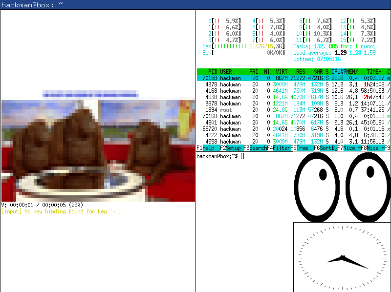

# Missing Semester Window Manager MSWM
Missing Semester Window Manager is an attempt at passing the course "Missing Semester" by implementing a custom window manager in Rust based on `x11rb`.
The aim is to remain minimalistic in design with a clean implementation of essentials as well as functionalities according to our (mostly Keanus') personal preferences.

~ Keanu Pöschko, Peter Pfeiffer



## Installation

### Requirements
This project is designed for Linux.
While it may work on Mac-Systems, we cannot guarantee for full feature availability.
MS Windows is not supported.

Installation of `xserver-xephyr`, `xinit` and `libxkbcommon-x11-dev` may be required.
If you are using aptitude, the correct dependencies can be installed via apt-get:
```bash
sudo apt-get install xserver-xephyr xinit libxkbcommon-x11-dev
```
(If you are using a system that does not have aptitude, you probably do not need help with this...)

### Rust
We do not ship binaries, so you will have to compile it yourself. For this, cargo is required.
It can be installed with:
```bash
curl https://sh.rustup.rs -sSf | sh
```
To compile the project, execute
```bash
cargo build
```
in the directory `mswm`. Cargo automatically takes care of any crate-based dependencies.

## Usage

### Testing
Testing a window manager beforehand is important.
Therefor, we include a script (`run.sh`) that lets you play around with MSWM in a safe environment without having to change your system defaults.
It also takes care of compiling the project.
To exectue it run:
```bash
./run.sh
```
It opens a virtual desktop (xephyr) with a console, a some windows for you to play around with.
The mouse and keyboard can be captured/released with `ctrl + shift`.

While we are proud of what we have created thus far, we would not yet recommend you to switch to MSWM on your main system ...

### Controls
Windows can be dragged by moving the cursor while pressing `M4 + left-mouse`.
Resizing works similarly with `M4 + right-mouse`.
The following shortcuts are available:
- `M4 + f` apply a fibonacci window layout
- `M4 + g` apply a tree window layout
- `M4 + j` move window up
- `M4 + k` move window down
- `M4 + SHIFT + c` kill focused window
- `M4 + SHIFT + RETURN` spawn program `xterm`

(`M4` is usually the super-key in linux based systems; for some MAC based systems it is `M2` instead.)

##License

MSWM is free software: you can redistribute it and/or modify it under the terms of the GNU General Public License as published by the Free Software Foundation, either version 3 of the License, or (at your option) any later version.

This program is distributed in the hope that it will be useful, but WITHOUT ANY WARRANTY; without even the implied warranty of MERCHANTABILITY or FITNESS FOR A PARTICULAR PURPOSE. See the GNU General Public License for more details.

Consult <https://www.gnu.org/licenses/> for further information.
